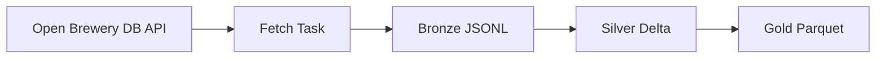

# Architecture

## Overview

The pipeline consumes data from the Open Brewery DB API and stores it in a medallion (lakehouse) architecture with three layers: Bronze, Silver, and Gold.

## Data Flow

## Layers

### Bronze

- **Format**: JSON Lines (`.jsonl`)
- **Path**: `data/bronze/breweries/run_id={run_id}/breweries.jsonl`
- **Characteristics**:
  - Raw data as returned by the API
  - One file per run for traceability
  - Atomic write: temp file → rename on success (no partial data on failure)
  - Validation before write: required fields, partition keys, record count

### Silver

- **Format**: Delta Lake (via delta-rs)
- **Path**: `data/silver/breweries/`
- **Partitioning**: `country`, `state_province`
- **Transformations**:
  - Column selection (drop deprecated `state`, `street`)
  - Type coercion (lat/long to float)
  - Add `ingested_at` (run timestamp) and `source_file` (Bronze file name) for lineage
  - Deduplication by `id` (keep last by `ingested_at`)

### Gold

- **Format**: Parquet
- **Path**: `data/gold/breweries_by_type_location/`
- **Schema**: `brewery_type`, `country`, `state_province`, `brewery_count`, `aggregated_at`
- **Logic**: Aggregation from Silver, overwrite per run

## Orchestration

- **Tool**: Apache Airflow
- **Executor**: LocalExecutor
- **Schedule**: Daily (`@daily`)
- **Tasks**: fetch → load_bronze → transform_silver → aggregate_gold
- **Run semantics**: Tasks are idempotent—each run overwrites or writes to run-scoped paths (e.g. Bronze `run_id=...`). Silver merges new Bronze with existing Silver (in-memory) then overwrites the Delta table; Gold overwrites per run.

## Tech Stack

| Component | Choice |
|-----------|--------|
| API | Open Brewery DB (REST) |
| Orchestration | Airflow 2.10 |
| Language | Python 3.10+ |
| Bronze | JSONL |
| Silver | Delta Lake (deltalake / delta-rs) |
| Gold | Parquet |
| Containerization | Docker, Docker Compose |
