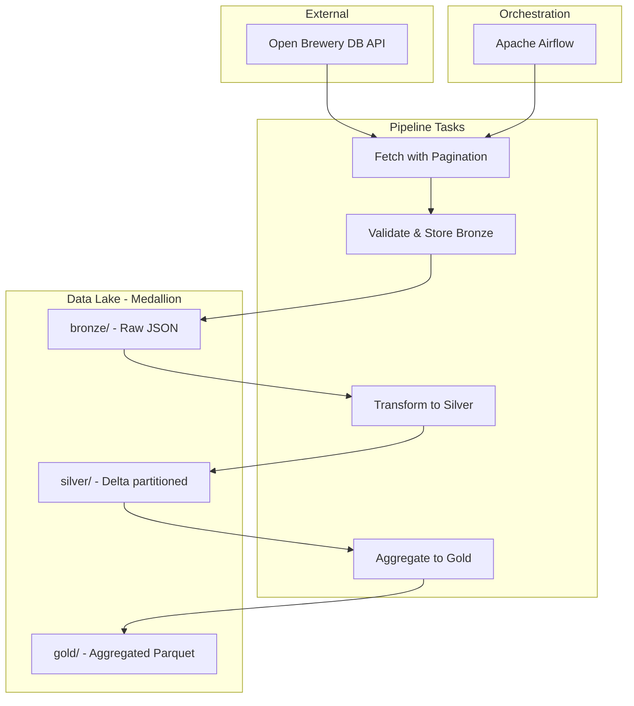

# Breweries API Data Pipeline - Implementation Plan

## Architecture Overview



---

## 1. Project Structure

```
breweries-api-data-pipeline/
├── docker-compose.yml           # Airflow + Postgres
├── Dockerfile                   # Custom Airflow image with deps
├── .env.example                 # Env vars template (SMTP, paths)
├── pyproject.toml               # Project metadata, pytest config
├── requirements.txt
├── README.md
├── docs/
│   ├── PLAN.md                  # This implementation plan
│   ├── ARCHITECTURE.md          # Design, data flow, diagrams
│   ├── DECISIONS.md             # Trade-offs, rationale
│   ├── EMAIL_SETUP.md           # SMTP / alerting setup
│   ├── PRACTICES_REVIEW.md      # Python, SE, Airflow practices review
│   └── AI_INTERACTIONS.md       # Log of AI-assisted development interactions
├── dags/
│   └── breweries_pipeline.py    # Main DAG definition
├── plugins/                     # Custom operators (if needed)
├── notebooks/
│   └── data_validation_medallion.ipynb  # Layer validation report
├── src/
│   ├── __init__.py
│   ├── api/
│   │   ├── __init__.py
│   │   └── client.py            # Paginated API client
│   ├── bronze/
│   │   ├── __init__.py
│   │   └── loader.py            # Raw persistence + validation
│   ├── silver/
│   │   ├── __init__.py
│   │   └── transformer.py      # Bronze → Delta, partitioning
│   └── gold/
│       ├── __init__.py
│       └── aggregator.py       # Breweries per type + location
├── data/                        # Local "buckets" (mount in Docker)
│   ├── bronze/
│   ├── silver/
│   ├── gold/
│   └── staging/                 # Fetch task output before Bronze
└── tests/
    ├── conftest.py              # Pytest fixtures
    ├── test_api_client.py
    ├── test_bronze_loader.py
    ├── test_silver_transformer.py
    └── test_gold_aggregator.py
```

---

## 2. API Layer (Pagination)

**Endpoint:** `https://api.openbrewerydb.org/v1/breweries`  
**Metadata:** `https://api.openbrewerydb.org/v1/breweries/meta` → `total` (~9251 breweries)

**Implementation:**
- Fetch metadata first to get `total`, compute pages: `ceil(total / per_page)` with `per_page=200` (max)
- Iterate pages with `page` param; handle rate limits (retries with backoff)
- Return list of brewery dicts; raise informative errors on HTTP/JSON failures

**Key code location:** `src/api/client.py`

---

## 3. Bronze Layer

- **Format:** JSON Lines (`.jsonl`), one file per run for traceability and run isolation
- **Path pattern:** `data/bronze/breweries/run_id={run_id}/breweries.jsonl`
- **Atomic write for integrity:** Write to a temporary file first; only rename/move to final path on successful completion. If the run fails during execution (e.g., mid-write, validation failure), the file is never persisted—guaranteeing no partial or corrupted data in the Bronze layer.
- **Validation before write:**
  - Schema check: required fields per API documentation (non-null): `id`, `name`, `brewery_type`, `city`, `state_province`, `country`, `postal_code`, `state`
  - Null/empty checks on partition keys and required fields
  - Record count vs expected (from metadata)
- **Error handling:** Log invalid records, fail task if critical fields missing or count mismatch beyond threshold

---

## 4. Silver Layer (Delta Lake)

- **Format:** Delta Lake via `deltalake` (delta-rs) — no Spark, lightweight for local
- **Partitioning:** `country` and `state_province` (location as per requirements)
- **Transformations:**
  - Normalize field names (snake_case), drop deprecated fields (`state`, `street`)
  - Coerce types (lat/long to float, null handling)
  - Add `ingested_at` (run timestamp) and `source_file` (Bronze file name) for lineage
  - Deduplicate by `id` (keep last by `ingested_at`). Optionally merge with existing Silver (in-memory) then overwrite Delta table per run
- **Path:** `data/silver/breweries/` (Delta table root)

**Rationale for delta-rs:** Lighter than PySpark for local dev; supports ACID, time travel, schema evolution. Cloud migration can add Spark + Delta later.

---

## 5. Gold Layer

- **Output:** Parquet with overwrite per run
- **Schema:** `brewery_type`, `country`, `state_province`, `brewery_count`, `aggregated_at`
- **Path:** `data/gold/breweries_by_type_location/`
- **Logic:** Read Silver Delta, group by `brewery_type`, `country`, `state_province` (aggregation keys), output `brewery_count` and `aggregated_at`; overwrite per run

**Rationale for Parquet over Delta in Gold:** The Gold layer is a simple aggregated view recomputed each run. It does not require ACID transactions, time travel, or merge/upsert semantics. Parquet is lighter (no transaction log), cheaper to write, and sufficient for read-only analytical queries. Delta would add overhead without benefit for this use case.

---

## 6. Airflow DAG

- **Schedule:** Daily (configurable via variable)
- **Schedule rationale:** Brewery data (names, locations, types) changes infrequently. A daily run balances freshness with resource usage and API load. Hourly runs would not justify the added cost given the low volatility of the source data.
- **Tasks:**
  1. `fetch_breweries` — PythonOperator calling API client
  2. `load_bronze` — PythonOperator: validate + write Bronze
  3. `transform_silver` — PythonOperator: Bronze → Delta
  4. `aggregate_gold` — PythonOperator: Silver → Gold
- **Dependencies:** Linear chain
- **Retries:** 2 retries, 5 min delay
- **Failure handling:** `on_failure_callback` to send email (see below)

---

## 7. Email Alerting

- **Scope:** DAG/task failures (timeouts, infra, data quality failures)
- **Mechanism:** Airflow `email_on_failure=True` + SMTP config in `.env`
- **Content:** Include DAG id, task id, execution date, error message, logs link (if available)
- **Documentation:** Provide step-by-step instructions in README and/or `docs/EMAIL_SETUP.md` so anyone who clones the repo can:
  - Configure their own SMTP provider (Gmail, SendGrid, Outlook, etc.)
  - Set required env vars from `.env.example`
  - Test the email alerting (e.g., trigger a failing task or use Airflow's "Test" feature)
- **Setup:** `.env.example` with `AIRFLOW__SMTP__*` vars; no credentials in repo

---

## 8. Docker Setup

- **Executor:** LocalExecutor (single machine, no Redis/Celery)
- **Services:**
  - `airflow-webserver`, `airflow-scheduler`, `airflow-triggerer` (Airflow 2.x)
  - `postgres` for Airflow metadata
- **Volumes:** Mount `./dags`, `./plugins`, `./data`, `./src` (or install src as package in image)
- **Dockerfile:** Extend `apache/airflow` base, add `deltalake`, `requests`, `pytest` (for CI)

---

## 9. Testing Strategy

| Component        | Tests                                                                 |
|------------------|-----------------------------------------------------------------------|
| API client       | Mock HTTP responses; pagination logic; error handling (404, timeout)  |
| Bronze loader    | Schema validation; invalid record handling; atomic write; file write |
| Silver transformer | Partitioning; deduplication; type coercion                           |
| Gold aggregator  | Correct counts; schema of output                                      |

**Scope:** Unit tests for core logic; one integration test (optional) that runs full pipeline on small fixture. Avoid over-testing (e.g., no tests for trivial glue code).

---

## 10. Documentation

| File                      | Content                                                                 |
|---------------------------|-------------------------------------------------------------------------|
| `README.md`               | Quick start, Docker commands, env vars, email setup, project overview   |
| `docs/ARCHITECTURE.md`    | Medallion layers, data flow, tech choices                               |
| `docs/DECISIONS.md`       | Delta-rs vs Spark, partitioning choice, Parquet vs Delta in Gold, etc.  |
| `docs/AI_INTERACTIONS.md` | Template for logging: mode (Chat/Composer/Agent), model, prompt, output |
| `docs/EMAIL_SETUP.md`     | Step-by-step email/SMTP setup for any provider, testing instructions    |

**AI Interactions log format (per entry):**
```markdown
## [Date] - [Brief title]
- **Mode:** Composer / Chat / Agent
- **Model:** (e.g., Claude Opus 4.5)
- **Prompt:** [User prompt summary]
- **Output summary:** [What was produced]
- **Files changed:** (if any)
```

---

## 11. Error Handling Principles

- Use custom exceptions (e.g., `APIError`, `ValidationError`) with clear messages
- Log context: run_id, record count, failed record sample
- Fail fast on critical issues; log and skip on non-critical (e.g., single bad record)
- Airflow task failure surfaces error in UI and triggers email

---

## 12. Implementation Order

1. Project scaffold (structure, requirements, .gitignore)
2. API client + tests
3. Bronze loader + tests
4. Silver transformer + tests
5. Gold aggregator + tests
6. DAG wiring
7. Docker setup
8. Documentation (README, ARCHITECTURE, DECISIONS, AI_INTERACTIONS, EMAIL_SETUP)
9. Final validation and README run instructions

---

## Resolved Decisions

- **Partitioning:** `country` + `state_province`
- **Bronze format:** One file per run; atomic write (temp file → rename on success) to guarantee no partial data on failure
- **Email provider:** Any SMTP; documented so anyone cloning can configure and test with their own email
